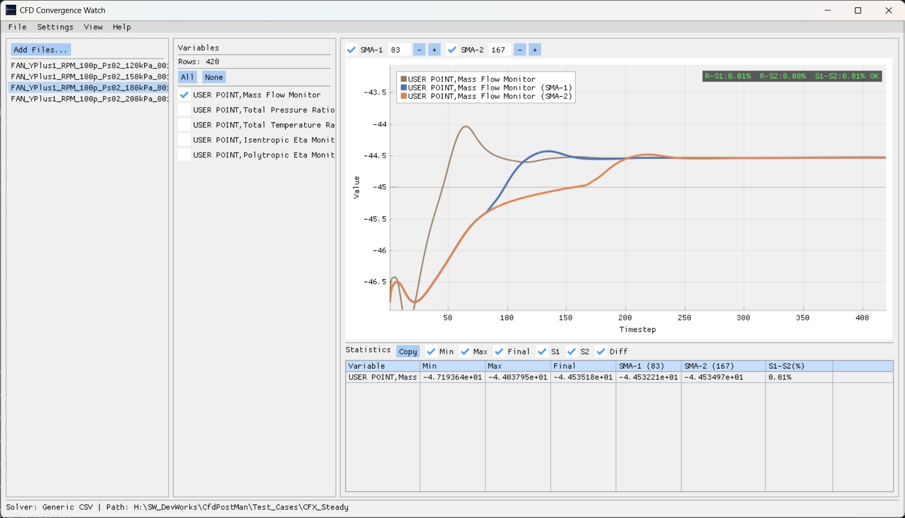

# CFD Convergence Watch

A lightweight desktop tool for visualizing and analyzing CFD solver convergence history.

## Features

- Load monitor point history files from multiple CFD solvers
- Interactive chart with pan, zoom, and auto-fit
- Dual Simple Moving Average (SMA) for convergence evaluation
- Convergence overlay with color-coded indicators (OK / ~ / X)
- Statistics table with clipboard copy (Excel-compatible)
- Dark, Light, and Classic themes

## Supported Solvers

| Solver | Type | File Format |
|--------|------|-------------|
| Generic CSV | - | `.csv` |
| Ansys CFX | Steady | `.csv` |
| FlexCompute Flow360 | Steady / Transient | `.csv` |
| Ansys Fluent | Steady / Transient | `.out` |
| SU2 | Steady | `.csv` |

## Download

Download the latest release from the [Releases](../../releases) page.

## Documentation

- [User Manual (English)](docs/user_manual_en.md)
- [User Manual (Korean)](docs/user_manual_ko.md)

## System Requirements

- Windows 10 or later
- DirectX 11 compatible GPU

## License

Freeware - free for personal and commercial use. No warranty.

Copyright 2025 CLEW, Inc.
https://www.clew.tech
