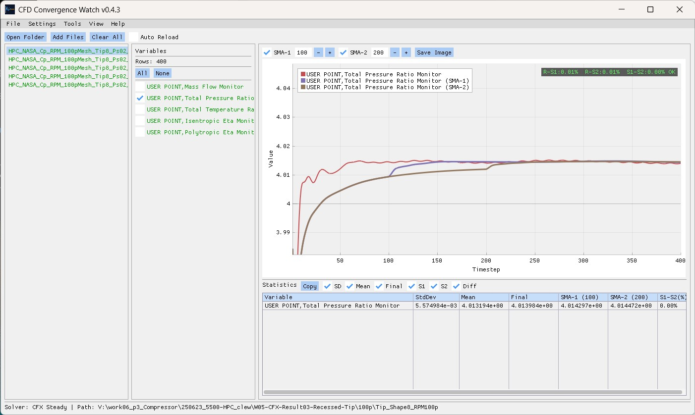

# CFD Convergence Watch

A lightweight desktop tool for visualizing and analyzing CFD solver convergence history.

## Features

- Load monitor point history files from multiple CFD solvers
- Interactive chart with pan, zoom, and auto-fit
- Dual Simple Moving Average (SMA) for convergence evaluation
- Convergence overlay with color-coded indicators (OK / ~ / X)
  also reflected in the Variable Panel and File Panel name colors
- Statistics table (StdDev, Mean, Final, SMA-1/2, S1-S2%) with
  clipboard copy (Excel-compatible)
- Auto Reload — polls loaded files every 2s for live monitoring
- Save Image — export the chart area as PNG
- Dark, Light, and Classic themes
- Cross-platform: Windows and Linux (unified GLFW + OpenGL3 backend)

## Supported Solvers

| Solver | Type | File Format |
|--------|------|-------------|
| Generic CSV | - | `.csv` |
| Ansys CFX | Steady | `.csv` |
| FlexCompute Flow360 | Steady / Transient | `.csv` |
| Ansys Fluent | Steady / Transient | `.out` |
| SU2 | Steady | `.csv` |

## How to Use

1. Set up user-defined monitor points in your CFD solver and run the simulation.
2. Open the exported monitor history files (CSV or OUT) in CFD Convergence Watch.
3. Select the matching solver preset from **Settings > CFD Solver**.
4. Check the variables you want to inspect and quickly evaluate convergence using the SMA overlay and convergence indicators.

## Download

Download the latest release from the [Releases](../../releases) page.

## Documentation

- [User Manual (English)](docs/user_manual_en.md)
- [User Manual (Korean)](docs/user_manual_ko.md)

## System Requirements

- Windows 10 or later, or Linux (Ubuntu 22.04+ recommended)
- OpenGL 3.0 compatible GPU

## Acknowledgments

Built with [Dear ImGui](https://github.com/ocornut/imgui) and [ImPlot](https://github.com/epezent/implot) (MIT License).

## Trademarks

ANSYS, CFX, and Fluent are registered trademarks of ANSYS, Inc. Flow360 is a trademark of FlexCompute, Inc. SU2 was developed at Stanford University. This software is not affiliated with, endorsed by, or sponsored by any of these organizations.

## License

Freeware - free for personal and commercial use. No warranty.

Copyright 2025 CLEW, Inc.
https://www.clew.tech
